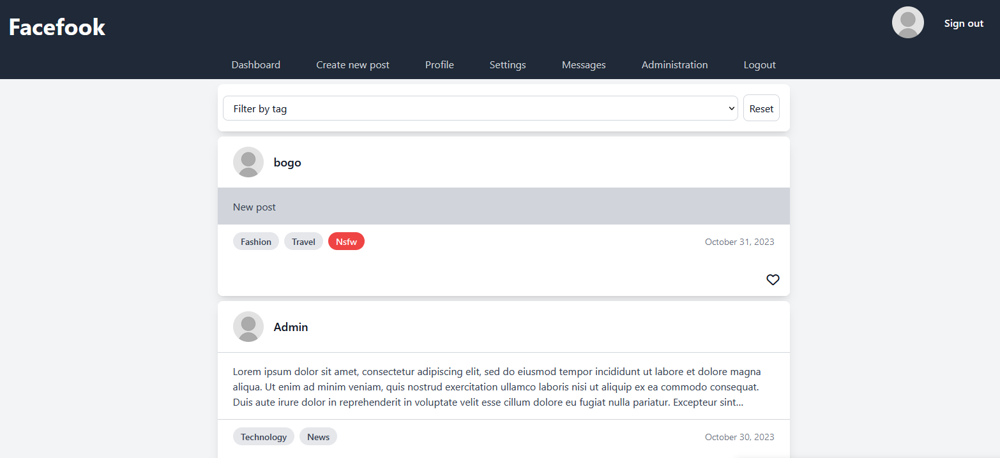
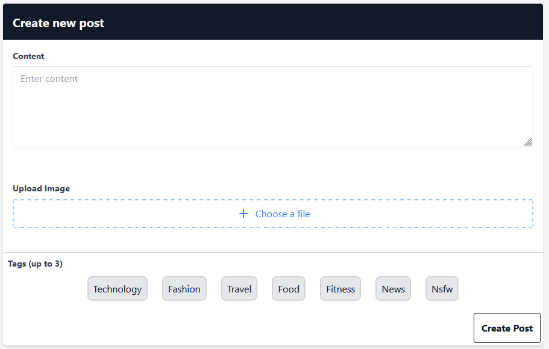
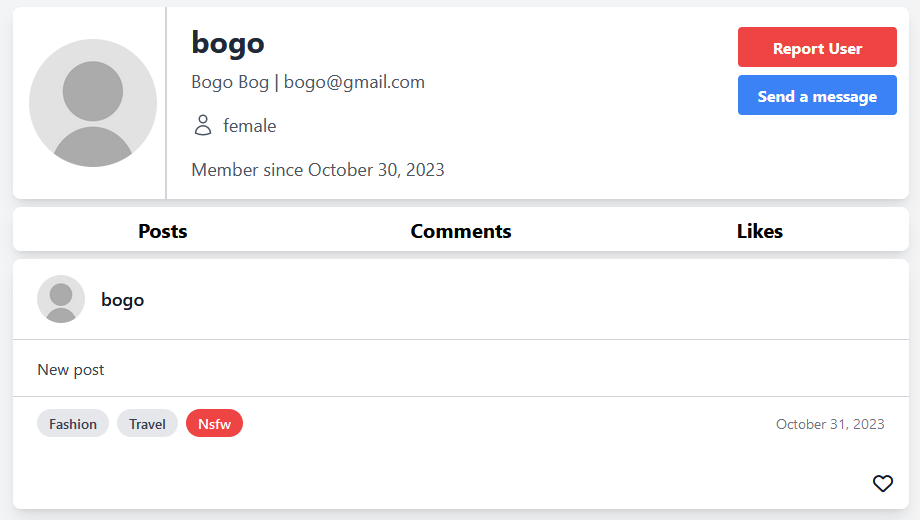
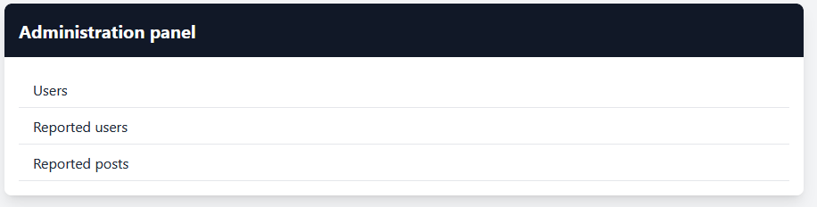
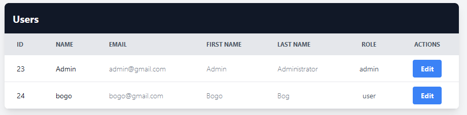
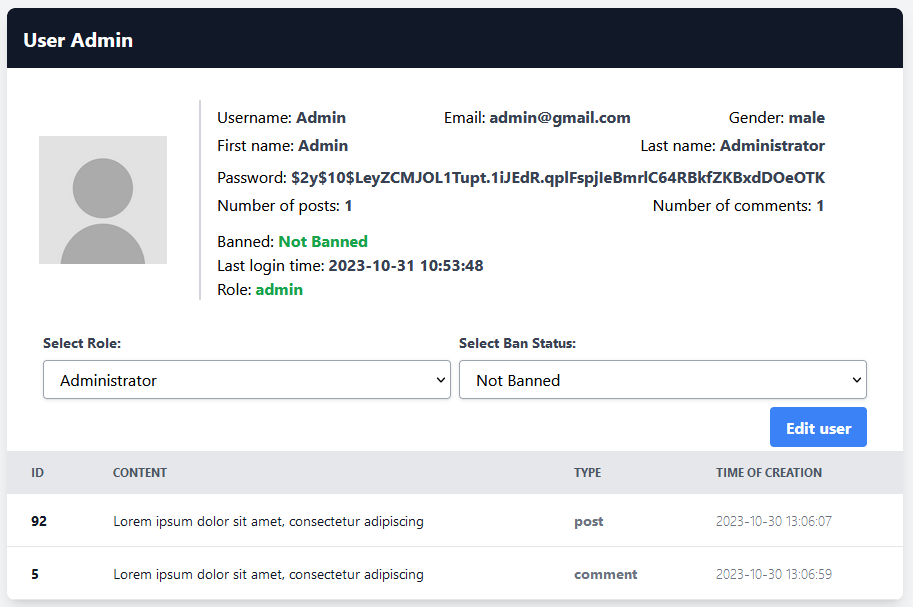
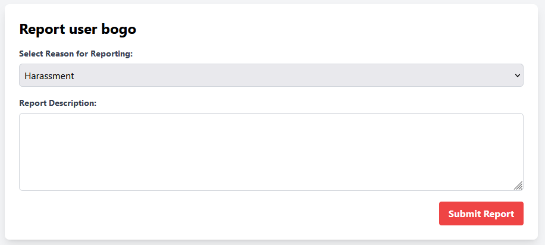
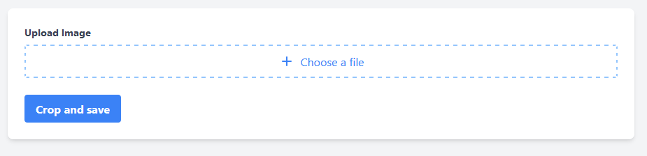
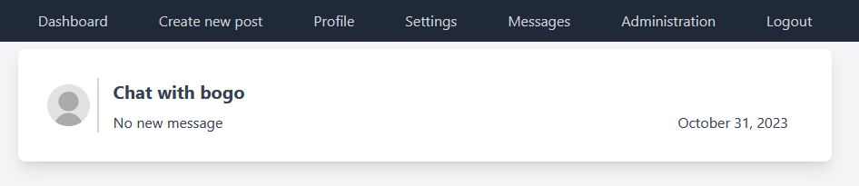
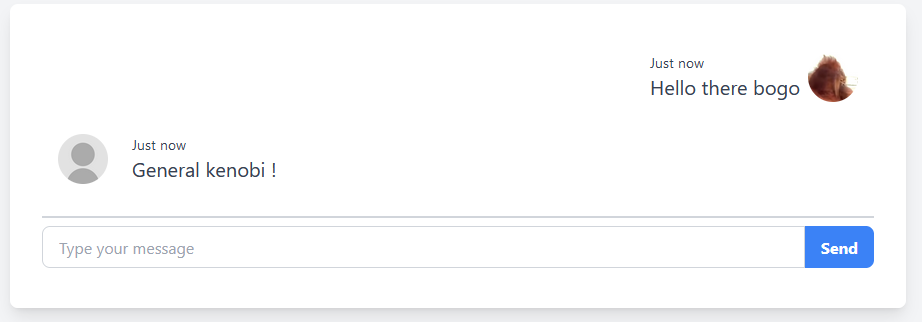

# Social app - Facefook
- Social app created using PHP 8.1 using Nette PHP framework

### Tech stack
| Frontend   | Backend   | Additional libraries |
|------------|-----------|----------------------|
| **JQuery** | **PHP**   | **Ratchet PHP**      |
|         | **Nette** | **TailwindCSS**      |
|            | MySQL     |                      |

## Features
- Users can create posts with images
  - Posts can have comments
  - Users can like posts/comments
  - Post can have upto 3 tags
    - Posts with images and NSFW tags are blurred
  - Posts can be filtered by tags
- Users can upload and crop profile pictures
- Pagination 
- Real-time chat between users
- Users can report other users
- Admin panel, where administrators can view information about users, reports, change roles and ban users
- Responsive design

### Planned updates
- Proper settings for profile, right now they do nothing
- Performance fixes
- File storage, users will have the option to upload files and share them with other users
- Improvement to chatting service, where users will have the option to form groups
- Right now banning users does nothing, will be further improved by limiting/disabling profile of users
- Proper NSFW filters
- Dockerization

## Project images

